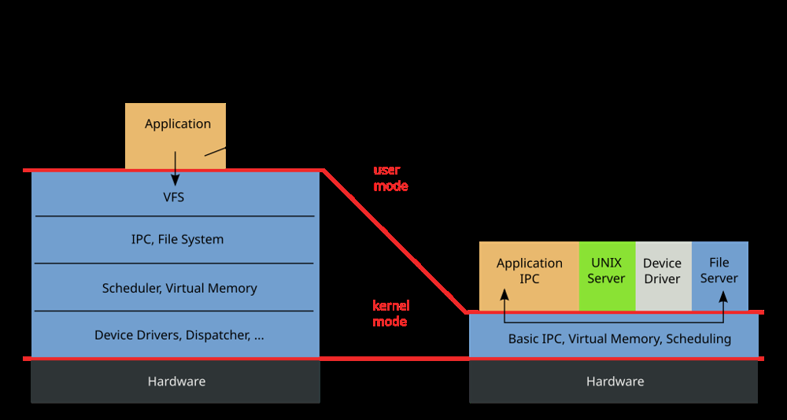

# Designing a Modern OS Kernel from Scratch

Developing a new operating system kernel today means learning from decades of experience with Unix/Linux, Windows NT, BSD, Mach, and more. Some classic design elements remain valuable, while others should be rethought for modern needs. This answer explores key design choices – from kernel architecture to security, performance, and adoption – explaining what should be kept the same and what could be different in a contemporary kernel design.

## Kernel Architecture: Monolithic vs. Microkernel (and Hybrid)

Monolithic vs Microkernel design: In a monolithic kernel (above), the OS runs most services (device drivers, file systems, etc.) in kernel space. In a microkernel (right), only a minimal core (CPU scheduling, memory, IPC) runs in kernel mode, with most services in user space for isolation and modularity. This fundamental choice impacts security and performance.

Monolithic kernels (like traditional Unix/Linux) bundle all core services and drivers into one large kernel. This yields fast direct calls within the kernel and minimal context-switch overhead – ideal for performance. For example, when a process reads a file on Linux, it traps into the kernel and the kernel’s filesystem and driver code handle it with just a couple of mode switches (to kernel and back). The downside is that a bug in any driver or subsystem can crash the whole system or be exploited to compromise security.

Microkernels (like Mach or modern seL4) take the opposite approach: the kernel does only essentials (hardware access, memory management, inter-process communication) and runs everything else (drivers, file systems, network stack, etc.) as user-space services. This design greatly reduces the kernel’s attack surface and isolates faults – e.g. a crashed audio driver in a microkernel can be restarted without bringing down the system. The trade-off is overhead: interactions that would be simple function calls in a monolithic design become IPC messages and context switches in a microkernel. A file read might require multiple user/kernel crossings and IPC calls (for the file server and disk driver), incurring several context switches and privilege transitions. Historically, this performance penalty kept microkernels out of general-purpose use when CPU speeds were limited.

Hybrid kernels attempt to get the “best of both.” Windows NT, for example, started as a microkernel-influenced design with a small kernel and many services in user mode, but over time moved more components into kernel space to boost speed (notably, graphics drivers were moved into the kernel in NT 4.0 to improve GUI performance). The Windows NT architecture still maintains a modular structure (with a layered “Executive” and a hardware abstraction layer) but runs in a single address space for efficiency. Apple’s macOS takes a hybrid approach too: the XNU kernel combines a Mach microkernel with BSD Unix components in kernel space.

**What to keep the same:** Embrace a modular structure and clear interfaces between components. Monolithic kernels proved highly efficient, and that’s still crucial for performance-sensitive tasks. The success of Linux’s monolithic design shows that performance wins users and can be maintained by rigorously fixing bugs as they arise. A new kernel should preserve fast in-kernel operations for common tasks and allow low-overhead access to hardware.

**What to do differently:** Favor isolation and fault tolerance wherever possible. With modern hardware, the performance cost of isolation is less prohibitive than before, and reliability/security are top priorities. A pragmatic design might be a hybrid: keep the hottest code paths in kernel for speed, but run risky or less-used services (like experimental drivers, filesystems) in user-mode processes. For example, device drivers could run in user space to prevent a buggy driver from crashing the system. Some operating systems already move certain drivers to user mode (e.g. audio or printer drivers) or use frameworks like FUSE (Filesystem in Userspace) for filesystems. A modern kernel could be designed to isolate drivers by default and use fast IPC or shared memory channels to communicate with them. This approach, combined with today’s faster CPUs and advanced IPC techniques, can mitigate the traditional microkernel overhead while dramatically improving stability and security.

In summary, a modern kernel should carefully balance the security/stability benefits of microkernels with the performance of monolithic kernels. The world has largely favored performance, as Linux and Windows show, but new designs (like Google’s Fuchsia Zircon microkernel) demonstrate we can revisit microkernel ideas with better performance in mind. The kernel’s architecture must be chosen in light of its target use (embedded vs. desktop vs. server), but a lean core with modular extensibility is a desirable modern feature.

## Security and Privilege: Principle of Least Privilege

Security can no longer be an afterthought – modern OS kernels must be designed with principle of least privilege and robust security mechanisms from day one. Early Unix-like systems had a coarse security model (superuser vs normal user) and large trusted codebases. Today’s environment of constant cyber threats demands finer granularity and built-in safeguards.

**Capability-Based Security:** One modern design feature is a capability-based security model, where access to resources is governed by unforgeable tokens (capabilities) rather than global identifiers. The Windows NT kernel was ahead of its time here: from the start it used security access tokens to represent user privileges, and every process had to present a valid token to access resources. This is effectively a capability system – an idea that can be taken further in a new kernel. For instance, Google’s Fuchsia is a capability-based OS where handles to objects are the only way to access them. A new kernel could make all resource handles (files, sockets, devices, etc.) true capabilities with built-in permission bits, so that security checks are uniform and centralized. This uniform object model was a strength of NT’s design: all kernel objects (processes, files, events, etc.) were handled through a common object manager, allowing centralized permission checks and a single namespace for all objects. A modern kernel should similarly enforce that no code gets more privilege than needed – for example, a driver process might only hold a capability for the device it manages and nothing else.

**User-Space Isolation and Sandboxing:** Building on a microkernel or hybrid architecture, strong isolation between components is critical. Instead of the whole OS sharing one administrator/root domain, each service or app can be sandboxed. Fuchsia uses the concept of namespaces to give every component its own private view of resources, effectively making each process “root” of its own sandbox with no access to others by default. This prevents many attacks: a compromised music player app, for example, simply cannot read your emails or system files because the kernel design doesn’t allow it (the process has no namespace access to those files). A modern kernel should incorporate containerization primitives at its core – much like Linux added namespaces and cgroups to isolate processes and limit resources. FreeBSD’s jails (early container tech) and Solaris Zones showed the value of baked-in isolation for services. From scratch, one could design the kernel so that processes are isolated by default and must explicitly be granted shared resources or IPC channels to communicate. This would make privilege escalation or lateral movement vastly harder by design.

**Kernel Self-Protection:** Security also involves protecting the kernel itself. Modern kernels should include features like address space layout randomization (ASLR) for kernel memory, stack canaries, and execution prevention (W^X policies) to thwart exploits. These have become standard in Linux and Windows kernels in the last decade. Additionally, support for secure boot and verified kernel modules is a must, ensuring that only trusted code runs in the kernel. A new kernel could require cryptographic signatures on drivers or modules, for example, to prevent malicious code injection.

**Memory Safety:** A key difference we could embrace is using a memory-safe implementation language. Many kernel crashes and vulnerabilities come from memory errors in C/C++ (buffer overflows, use-after-free, etc.). Writing a new kernel in a safer language (like Rust) can eliminate an entire class of bugs. The Rust-based Redox OS project illustrates this: it’s a microkernel OS written in Rust, which “effectively eliminates entire classes of bugs and security vulnerabilities related to memory management that have plagued older OSs for decades”. Even Linux is gradually adding Rust components to improve safety. While rewriting everything in a new language is ambitious, even using Rust for drivers or high-level kernel components can greatly improve robustness. A modern kernel might keep a tiny hardware-control core in C/assembly (for low-level boot and CPU control) but implement higher layers and drivers in Rust for safety – getting memory safety without sacrificing too much performance.

In summary, a modern kernel should bake in security at every level: minimal privileged code, capabilities and tokens for access control, strong isolation between processes and services, and use of memory-safe practices. Unlike early Unix where performance or simplicity often trumped security, today we can aim for both – leveraging fast hardware to implement security features without making the system sluggish. Security and performance are not mutually exclusive if the design is thoughtful: for instance, using capabilities can make permission checks faster (one centralized check) even as it improves security, and isolating services can enable quick restarts and updates without full reboots. The conditions today (ransomware, APTs, critical infrastructure attacks) demand these security features, and users will adopt a new OS if it convincingly offers a safer computing environment without unacceptable performance cost.

## Performance and Multi-Core Scalability

Performance remains a make-or-break aspect of kernel design, especially for broad adoption. Modern hardware is massively parallel and heterogeneous, so a new kernel must excel at multi-core scaling, efficient I/O, and low-latency operation.

**Preemptive Multitasking and SMP:** These are table stakes – any new kernel should be fully preemptive and designed for symmetric multi-processing from the ground up. Early Unixes were single-CPU and even non-preemptive in kernel (meaning a long system call could block other tasks). Those days are gone. Windows NT, for example, was designed with SMP support and kernel preemption from day one (a strength over older Unix systems that had to bolt it on later). Our new kernel should allow threads on multiple CPUs, with fine-grained locking or lock-free structures to minimize contention. It should handle interrupts and scheduling on multi-core systems seamlessly. Modern kernels like Linux have evolved to use per-CPU data structures, RCU (read-copy-update) locks, and other techniques to scale to dozens or hundreds of cores. A fresh design can incorporate these lessons: avoid global locks, prefer per-core or per-object locking, and possibly use message-passing between cores to reduce cache contention.

**Multikernel / Message-Passing Architecture:** One radical approach is the multikernel model proposed by the research OS Barrelfish. It treats a multi-core machine as a network of independent cores, communicating via explicit messages instead of implicitly sharing memory. This can improve scalability by eliminating implicit sharing: each core runs its own kernel instance, and state is replicated rather than shared globally, so adding cores doesn’t introduce lock bottlenecks. While this is an extreme design, a modern kernel could adopt some of these ideas. For example, it might use message passing for certain subsystems to better utilize many-core systems or to support heterogeneous processors (where not all cores share memory). At the very least, the kernel should be NUMA-aware (optimized for non-uniform memory access on multi-socket systems) and perhaps allow core specialization (e.g. dedicating a core to handle networking or storage I/O). The takeaway is that scaling to modern hardware is crucial – the kernel must remain efficient as core counts increase, by minimizing contention and using parallelism effectively.

**Asynchronous I/O and Event-Driven Design:** Modern applications (servers, GUIs, etc.) demand high-throughput and low-latency I/O. A new kernel should incorporate asynchronous, non-blocking I/O as a first-class feature. Windows NT has long supported asynchronous I/O (using I/O Request Packets and allowing threads to perform overlapped I/O). Linux historically used blocking I/O or complicated POSIX AIO, but recently introduced io_uring, a modern async I/O interface that greatly improves performance by cutting system call overhead. Our kernel, from scratch, can be designed so that most syscalls don’t block the calling thread unless necessary – instead using callback mechanisms, completion queues, or promises. This could make event-driven architectures (like those in high-performance servers) more efficient and easier to implement. In practice, this means providing kernel primitives to wait on multiple events (e.g. like Windows WaitForMultipleObjects or Linux epoll), and making file, network, and device I/O all work with a unified event notification system. For example, Windows provides a unified mechanism to wait on various object types (processes, files, signals) because of its object-centric design; a new kernel could offer a similarly unified event loop facility for user programs.

**Optimized IPC:** If we adopt a more modular or microkernel approach, fast inter-process communication is vital. Techniques like memory-mapped message queues, lock-free ring buffers, or even hardware-assisted messaging (like Intel APIC messaging or cache line bouncing) can accelerate IPC. Fuchsia’s Zircon microkernel, for instance, uses a special IPC mechanism (channels with an IDL) and mainly non-blocking syscalls to keep IPC fast. Our design should likewise invest in a high-performance IPC so that splitting the system into components doesn’t incur undue overhead. This might involve batching messages, pipelining, and avoiding copying data multiple times (using shared memory for large transfers).

**Real-Time and Responsiveness:** For desktop use, the kernel should prioritize responsiveness (low latency for UI interactions, audio, etc.). This could mean implementing preemptive priority scheduling, so high-priority (e.g. UI) threads preempt background work. It might also involve optional real-time scheduling classes for multimedia or industrial use. Linux has a “completely fair scheduler” (CFS) for general use and optional real-time extensions; a new kernel could incorporate a hybrid scheduler that ensures interactive tasks get CPU time quickly while also optimizing throughput for batch tasks. Tuning for desktop vs server can be done via scheduler policy: e.g. a “desktop mode” might favor low latency (short time slices, quick preemption of CPU-bound tasks), whereas a “server mode” might favor throughput (longer quanta, less context switching). These modes could be configurable.

In summary, a modern kernel must scale and perform on current hardware: support many CPUs, handle asynchronous operations efficiently, and be flexible to different workload demands. By learning from past kernels – NT’s early SMP design, Linux’s concurrency refinements, and research like Barrelfish – we can design a kernel that is both fast and scalable. This performance focus is also a driver for adoption: users (especially server operators) will only embrace a new OS if it can at least come close to established systems in throughput and latency. Fortunately, we have more CPU power than ever to apply clever designs (like message-passing or parallelism) without sacrificing speed.

## Memory Management and Resource Handling

Memory management is a core function of any kernel. A new kernel should stick with proven concepts like virtual memory, paging, and protected memory, but also adopt modern innovations in how memory is organized and used.

**Virtual Memory and Unified Cache:** All major OS kernels use an MMU with paging to provide each process a virtual address space and to isolate processes’ memory. That should remain the same – it’s a foundation for security (no process can read/write another’s memory directly) and for convenience (each process thinks it has contiguous memory). One design improvement that is now standard (but wasn’t always) is a unified memory cache: the OS should not maintain separate caches for file I/O and process memory. Old Unix systems once had a split cache (page cache vs buffer cache), which led to inefficiencies and double-caching of data. Modern designs unify these. Windows NT, for instance, was designed from the start with a unified memory architecture – physical memory is one pool whether used for file data or process pages. Linux and BSD also evolved to use unified page caches (e.g., BSD introduced a Unified Buffer Cache in 2002). So our kernel will definitely unify file and memory caches to let the VM system manage all memory dynamically for whatever is needed.

**Paging the Kernel and Overcommit:** One feature we might borrow from Windows is the ability to page out infrequently-used parts of the kernel itself to disk. Linux generally doesn’t swap out the kernel code or core structures (it can page out some infrequent allocations, but not code). NT made even kernel memory swappable (with careful exceptions) to save RAM on small systems. In today’s machines with abundant RAM, that is less crucial, but it’s an example of a forward-thinking design that could be considered if targeting memory-constrained environments. At the very least, the kernel should be memory-efficient and perhaps support demand-loading of kernel modules/drivers so that unused code isn’t resident.

**Memory accounting and isolation:** A difference in how kernels manage memory is whether they track ownership of memory pages by process. Windows has per-process working sets and does accounting of which process is using how much memory, whereas Linux historically treated memory globally (any process could cause paging that affects others). In a new design, we could aim for per-process (or per-container) memory accounting and limits to improve fairness and isolation. This ties into containerization: the kernel should natively support assigning memory quotas to groups of processes (like cgroups in Linux). This prevents one runaway process from OOM-ing the entire system and allows smarter decisions about who gets swapped or killed under memory pressure.

**Huge Pages and Advanced VM features:** Modern hardware supports multiple page sizes (4KB, 2MB, 1GB, etc.). The kernel should make use of large pages to boost performance for big memory allocations (reducing TLB misses). It should also support memory virtualization features like virtualization extensions (EPT/NPT) if acting as a hypervisor. If designing for servers, features like NUMA awareness (binding memory allocations to the nearest NUMA node) and memory compression or deduplication (as an option) could be included.

**Resource allocation and capabilities:** Extend the idea of capabilities to resources like memory, CPU time, and I/O bandwidth. A modern kernel might include a resource manager that can distribute and limit resources per security principal or container. This is something Google’s OSes (Android, for example) do at a higher level with cgroups; a new kernel could have an integrated and simpler model, given that we design it from scratch with multi-tenant use in mind.

In short, the fundamentals (virtual memory, paging, protection) stay the same – they’ve stood the test of time. But we incorporate modern enhancements: unified memory caches, rich accounting, and full use of hardware features for performance. These choices ensure the kernel is efficient with memory and fair in distributing it, which both improves performance and security (preventing one process from hogging all RAM or leaking data via memory side-channels).

## Device Drivers and Extensibility

Hardware support is the Achilles’ heel of any new OS – without drivers, the system won’t be practical. Our kernel design must consider how to handle device drivers in a modern, flexible way.

**Driver Model:** Linux takes an in-kernel approach for most drivers (monolithic model), whereas Windows has a hybrid approach: most drivers run in kernel mode, but there are user-mode driver frameworks for certain classes (e.g. printers, USB, to improve stability). A new kernel could innovate here. One appealing idea is to run drivers in user space by default, as a microkernel would. This greatly improves reliability – a faulty driver can’t crash the kernel, and malware in a driver would have limited access. Fuchsia’s kernel, for example, runs drivers as user-space components, leveraging its IPC system to interact with hardware through the kernel. We would adopt a similar stance: implement a lightweight user-space driver framework for most devices.

However, we must acknowledge performance trade-offs: some high-throughput devices (e.g. GPUs, network cards) benefit from being in kernel space for lower latency. Our design can be open to trade-offs: allow critical drivers or subsystems to be privileged if they meet certain safety standards (for example, a storage driver could be vetted and loaded into the kernel for speed, whereas less performance-critical or third-party drivers run in user mode). Also, new hardware techniques like virtualization extensions can reduce overhead: for instance, user-space drivers could use an IOMMU to safely DMA to memory without kernel mediation, or shared memory queues to communicate with the kernel, reducing context switches.

**Stable Interfaces vs Rapid Evolution:** Another design consideration is how drivers interface with the kernel. Linux deliberately does not maintain a stable in-kernel driver API – this forces drivers to be updated with the kernel (often by merging into the mainline), which has the benefit of coordinated evolution. Windows, conversely, provides a stable driver ABI (e.g. Windows Driver Model), enabling third-party vendors to ship drivers that work across OS versions (but at the cost of a more rigid kernel internal design). For a new OS trying to gain adoption, a stable driver ABI might attract hardware vendors to write drivers, knowing their code won’t break on every update. On the other hand, an open-source OS could encourage a Linux-like strategy of upstreaming drivers into the core, to ensure source compatibility and collective maintenance.

We should likely choose a middle path:
* Define clear, modular driver interfaces (for filesystems, network, graphics, etc.) and commit to supporting them long-term
* Provide an option for open source community drivers that can be updated along with the kernel

This could be done by having a driver compatibility layer – for example, an environment where a Linux driver could potentially run, or tools to ease porting Linux drivers to our OS. NetBSD has something akin to this for userland drivers, and Windows has Project Drawbridge/WSL for subsystems; any ability to reuse existing driver code would be a big boon for a new kernel.

**Extensibility and Modules:** The kernel should be modular. Loadable kernel modules (LKMs) or plugins allow adding filesystems, drivers, or other features without rebuilding the kernel. This is a standard feature now (Linux, BSD, Windows all support loadable drivers). We would include it too, with a focus on safety – e.g. modules might run in a sandbox or be signed to prevent tampering. Perhaps integrate a mechanism for live patching of the kernel for security fixes, as Linux’s livepatch and Windows Hotpatching do, to minimize reboots.

Additionally, consider I/O architecture: Windows uses an I/O Manager with pluggable filter drivers, Linux has a VFS for file systems and a device model for hotplug. A new kernel should incorporate a unified device model (like Linux’s device tree / driver model) that cleanly represents hardware devices and their drivers, making things like power management and hotplug easier. It should also support modern device features (think Thunderbolt hotplug, USB-C, etc. by design).

**What stays same:** We still need drivers to interface with hardware – that fundamental doesn’t change. Proven frameworks like a VFS (virtual filesystem) for supporting multiple filesystems, a network stack with modular protocol support, and a graphics subsystem are all concepts to carry over. For example, Unix introduced the VFS in 1990 to support more than one filesystem type, and NT did so from the beginning. We will also include a VFS layer to mount different filesystems seamlessly.

**What to do differently:** Emphasize driver isolation and recoverability. In older designs, a driver crash often means a system crash. In a modern design, we want the ability to unload or restart drivers on the fly. By running them in user mode or a lightweight container, the kernel can survive driver failures. This is a big reliability win – especially important for servers that need high availability. We also integrate debugging/tracing tools for drivers: perhaps a framework to run drivers in a special verbose mode or under simulation to ease development, which could encourage more contributors to write drivers for the new OS.

Ultimately, handling hardware gracefully will drive adoption: users expect their devices to “just work.” That means our kernel must quickly grow support for a wide range of devices. A clever strategy might be to leverage existing driver code (through API compatibility or even a virtualization layer that can run Linux drivers in a sandbox). Short of that, providing excellent documentation, stable interfaces, and memory-safe driver development (e.g. in Rust) could attract developers to write drivers for the new platform.

## Desktop vs. Server Considerations

The question of “desktop and server” usage is important – a modern kernel should be flexible enough to excel in both environments, even though they have different priorities.

On a desktop, users expect a responsive GUI, multimedia support, and plug-and-play hardware. This implies the kernel needs good support for GPUs, high-resolution timers (for smooth animation and low-latency audio), and perhaps scheduling tweaks for interactivity. One design choice is whether the GUI subsystem lives in the kernel or user space. Windows famously moved much of its windowing system (GDI/Window Manager) into kernel space for performance on NT-based systems, whereas Linux (and classic Unix) keep the GUI (X11/Wayland compositors) in userland, which enhances stability (a crashing X server doesn’t crash the whole OS). For our new kernel, we could opt for a compromise: keep core graphics drivers in kernel (for speed and direct hardware access) but run the window server or compositor in user space. With modern GPUs and APIs, it’s feasible to have efficient graphics without putting the entire GUI in the kernel. In fact, microkernel systems like QNX or MINIX have achieved graphical performance with user-space drivers by careful optimization. Given security is a concern, it’s likely wiser to avoid a monolithic GUI in kernel – instead, design a robust graphics driver model and let user-space window servers use it. The flexibility of Linux’s approach (multiple GUIs, replaceable UIs) is a strength we’d like to keep.

On a server, GUI is often irrelevant; stability, throughput, and manageability are king. The kernel should allow running headless and minimal – e.g. support a configuration where unnecessary subsystems (sound, GUI, even certain drivers) are not loaded. This is somewhat like Windows Server Core vs Desktop Experience, or a Linux system with no X server. A modular kernel helps here: you only include what you need. Also, server kernels benefit from features like NUMA optimizations, large page support, and virtualization. Our design should include a built-in hypervisor capability or at least first-class support for virtual machines (since in data centers, running VMs or containers is standard). For instance, Windows and Linux both can act as hypervisors (Hyper-V, KVM respectively); a new kernel could integrate this cleanly rather than as an afterthought. We might design the kernel so that it can partition resources between virtual machines or containers safely – effectively blending OS and hypervisor roles (similar to what Xen did by separating Dom0 kernel vs guest kernels).

**Scheduling differences:** Desktop scenarios value low latency (as noted, perhaps use preemptive round-robin with short quanta for UI threads), whereas servers value bulk throughput (longer quanta, batch processing optimizations). The kernel could have tunable scheduler profiles or auto-detect the type of workload. For example, Linux has “preemptible kernel” options that can be toggled for desktop vs server kernels. Our OS could even allow switching scheduler algorithms on the fly or per CPU set. This is something not common in mainstream OS (they usually have one scheduler for all), but research OSes have explored pluggable schedulers.

Another modern feature particularly useful for servers is hot-swapping and fault tolerance. We could design the kernel to support hot-pluggable CPUs and memory (common in high-end servers) and even microrebooting components. If a subsystem fails, the kernel could restart just that service (say, a fileserver process in a microkernel design) without a full reboot. This is akin to how some cloud OS or microkernels (like QNX) handle faults, and it maximizes uptime – very attractive for server deployment.

**Power management:** For desktops (and certainly mobile devices), the kernel must handle power-saving states, CPU frequency scaling, etc. A modern kernel from scratch can assume ACPI (or newer standards) for interfacing with firmware to control power states. On servers, power management is also important (to save energy in data centers), but it might be more about efficiently utilizing hardware (consolidating load to fewer machines when possible). Our kernel should include advanced power management but also let users override it (performance mode vs power-saving mode).

In essence, the same kernel can serve both desktop and server if it’s built with configurability and modularity. We would keep the core mechanisms the same – scheduling, memory, I/O – but allow different policies or configurations for different roles. This versatility is crucial for adoption: it means one OS can cater to multiple markets (like how Windows and Linux both scale from laptops to servers). We acknowledge the trade-offs, but by not hard-coding one policy, we remain open to both use cases.

## Adoption and Compatibility

Even the best kernel design will languish if nobody uses it. Driving adoption means addressing what people want and need in an OS today:

**Application Compatibility:** One major barrier for any new OS is the software ecosystem. Users and organizations have tons of software built for existing systems (Windows, Linux). To gain traction, a new kernel should provide compatibility layers or at least a clear path for developers. Windows NT’s early design, for instance, included subsystems to run software from other OS (DOS, OS/2, POSIX) by translating their calls into NT native calls. A modern equivalent might be providing a POSIX compatibility layer so that Unix/Linux software can be recompiled with minimal changes, or even an emulation layer for Linux syscalls (like WSL1 on Windows, which translated Linux syscalls to NT kernel calls). Adopting the POSIX API (at least partially) can instantly give access to a huge range of software. Our kernel doesn’t have to be a Unix clone, but offering a Unix-like interface (perhaps via a user-space server or a special compatibility mode) would drive adoption among developers. Alternately or additionally, the kernel could support running Linux as a guest more efficiently (containers or lightweight VMs) so users can fall back to Linux for legacy apps while we grow a native ecosystem.

**Driver Support:** As discussed, people want their hardware to work. Early on, bundling a new OS with broad hardware support is hard, but we can focus on a few strategies:
* Open-source drivers (maybe port some from Linux, since many are GPL or dual-licensed)
* Provide tools for vendors to write drivers easily (with good documentation and stable APIs)
* Maybe even support using existing firmware or drivers in a pinch (for example, using a wrapper to load a Windows NDIS network driver or a Linux GPU driver)

Projects like NDISwrapper on Linux showed this is possible, though not ideal long-term. The easier we make it for hardware makers to support the OS, the more likely the OS will be adopted by enthusiasts and eventually mainstream.

**Security and Reliability Selling Points:** In today’s climate, an OS that is demonstrably more secure and stable could attract users (especially enterprise or government users). If our kernel’s design (microkernel, capabilities, memory-safe code, etc.) yields far fewer crashes and vulnerabilities, that’s a compelling reason to adopt. For example, seL4 microkernel is formally verified for security – while that’s a high bar, even a largely bug-free record would differentiate a new OS. We should highlight features like isolated drivers (no more blue-screen from a bad driver), fine-grained permissions (apps only access what they should), and resistance to malware. These address real demands (ransomware and zero-day exploits are big fears). If we can claim that our OS reduces those risks (without sacrificing usability), certain niches will eagerly try it.

**Performance and Scalability:** To lure the server market or power users, the OS must show competitive or superior performance in some areas. Perhaps our fresh design can outperform Linux/Windows in specific scenarios (maybe lower latency due to a better scheduler, or better multi-core scaling due to less locking). If the performance is close but security is better, some may still adopt it. If performance is significantly worse, it will be a tough sell except for niche uses. So in design we aim for efficiency – and possibly leverage modern techniques like concurrency, async I/O, and optimized algorithms to have an edge in at least a few benchmarks.

**Community and Openness:** The success of Linux is partly due to its open-source nature and community development. A new kernel will likely need a similar openness to gain volunteers, academic interest, and company support. We should choose a permissive or copyfree license (MIT/BSD or Apache, or even GPL if we want to enforce openness – but GPL might deter some commercial use). Being open allows others to port the OS to new hardware, write drivers, and fix bugs, accelerating its maturity.

**Use-case Focus:** We might drive adoption by targeting a specific initial niche and expanding. For instance, focus first on IoT or embedded (where security is critical and legacy baggage is less) – if we succeed there, we can scale up to desktop/server. Or target the cloud/container market: design the kernel to run containers extremely well (lightweight isolation, fast context switches, minimal overhead), which could attract cloud providers or edge computing uses. Having a flagship use-case can gather a user base that in turn helps improve the system.

Finally, we should remember backward compatibility with our own updates. Enterprises value OSs that don’t break their software with each update. Linux’s “don’t break user-space” mantra is something to emulate. Our kernel should maintain stable syscalls and userland ABI once defined, so that software targeting version 1.0 still runs on 2.0, etc. This predictability drives confidence in adopting a new platform.

## Conclusion

Writing a kernel from scratch today allows us to blend the proven strengths of existing OSes with fresh ideas to meet modern demands:

- We keep the good ideas: robust virtual memory, preemptive multi-threading, multi-core support, modular file systems, and a rich network stack – all things that made Unix, Linux, and NT successful.
- We change what’s outdated or insecure: we reduce the kernel attack surface via microkernel or hybrid design, enforce least privilege with capabilities and sandboxing (learning from NT’s tokens and Fuchsia’s components), and use memory-safe implementation to eliminate whole classes of bugs.
- We carefully weigh trade-offs: security vs performance is not an all-or-nothing choice. For instance, isolating drivers and using fast IPC can yield both a stable and fast system. We choose hybrid approaches when needed, and leverage modern hardware to minimize overhead costs of safer designs.
- We address current conditions: users want security, privacy, and reliability and they want speed. They also want compatibility or at least a smooth migration path for their software and hardware. By building in compatibility layers and focusing on a strong developer ecosystem, a new kernel can gain adoption even in a world dominated by Windows and Linux.

In short, a modern kernel design would borrow from Linux (performance, open development), Windows NT (modularity, portability, unified object model), BSD/Unix (proven APIs, stability), and Mach/microkernels (isolation, message-passing) – combining these influences into a system prepared for the challenges of today’s desktop and server environments. The result would ideally be an OS that is secure by design, performant in practice, and adaptable enough to attract both users and developers, thus driving adoption.

## Sources

- [ExoticMandibles, “Is Linux kernel design outdated?”](https://stackoverflow.com/questions/131419/why-is-linux-not-a-microkernel)
- [Nikolai Thees, *Fuchsia: Rethinking OS Security Design after 50 Years*](https://os.itec.kit.edu/downloads/WS2020_OS_Vortrag_Fuchsia.pdf)
- [Julio Merino, *Windows NT vs. Unix: A design comparison*](https://julio.meroh.net/2007/06/windows-nt-vs-unix-design.html)
- [Fuchsia (operating system), Wikipedia](https://en.wikipedia.org/wiki/Fuchsia_(operating_system))
- [Damon Garn, *Comparing the Linux kernel vs. the Windows kernel*](https://www.techtarget.com/searchdatacenter/tip/Comparing-the-Linux-kernel-vs-the-Windows-kernel)
- [Francesco Ciulla, *Redox OS: Is the Future of Operating Systems Written in Rust?*](https://dev.to/francesco_ciulla/redox-os-is-the-future-of-operating-systems-written-in-rust-4g0a)
- [Baumann et al., *The Multikernel: A new OS architecture for scalable multicore systems*](https://www.microsoft.com/en-us/research/wp-content/uploads/2016/02/multikernel.pdf)